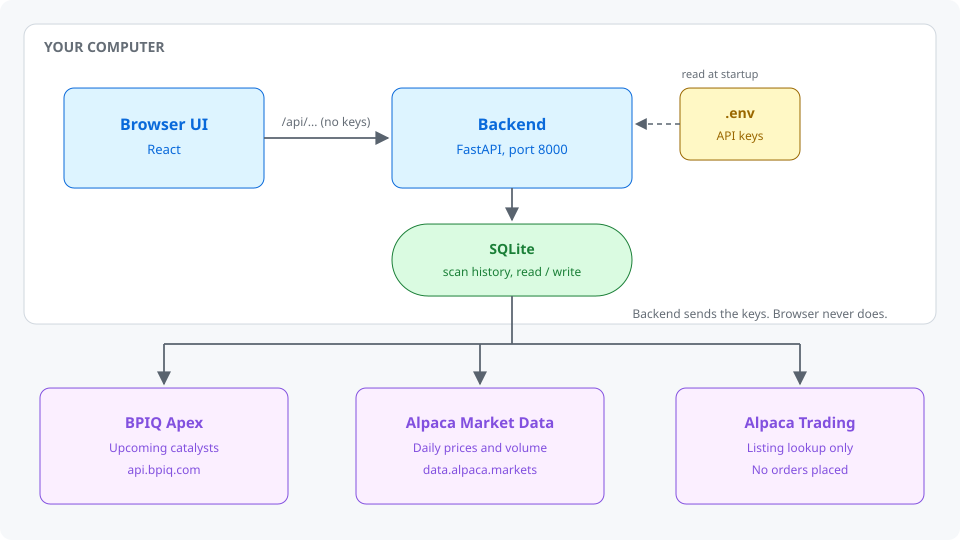
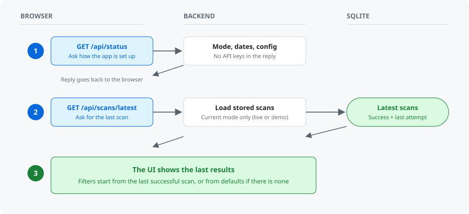
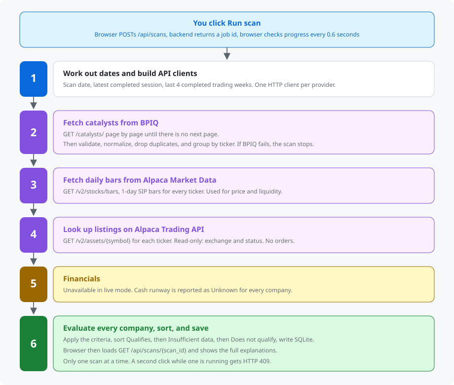
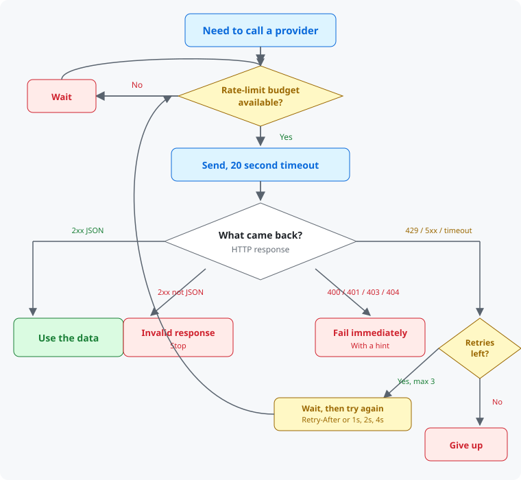
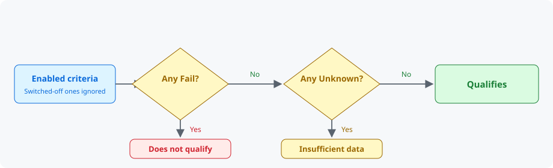
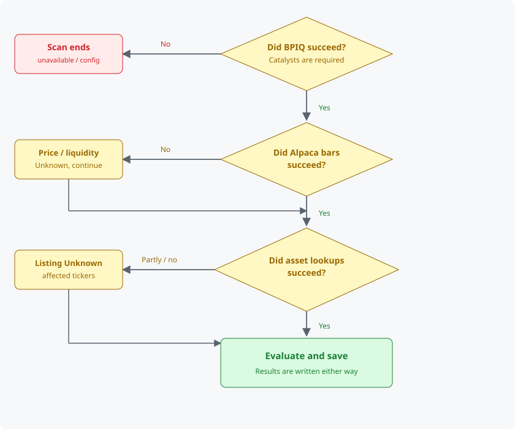
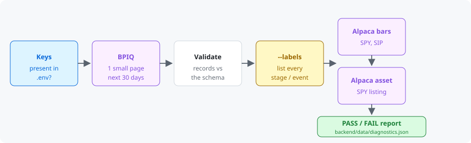

# How the Catalyst Screener works

This document describes the app running in **live mode**, connected to the BPIQ Apex REST API and Alpaca. Demo mode runs the same steps with synthetic responses; see [Demo mode](#demo-mode) at the end.

**Contents**

1. [The big picture](#1-the-big-picture)
2. [Configuration and credentials](#2-configuration-and-credentials)
3. [Opening the app](#3-opening-the-app)
4. [Running a scan, end to end](#4-running-a-scan-end-to-end)
5. [How each API is called](#5-how-each-api-is-called)
6. [How eligibility is decided](#6-how-eligibility-is-decided)
7. [Scan outcomes and failure handling](#7-scan-outcomes-and-failure-handling)
8. [Viewing, history, and export](#8-viewing-history-and-export)
9. [Checking the connection (diagnostics)](#9-checking-the-connection-diagnostics)
10. [Troubleshooting](#10-troubleshooting)
11. [Where things live in the code](#11-where-things-live-in-the-code)
12. [Demo mode](#demo-mode)

---

## 1. The big picture

The app has three parts: your browser, a local Python backend, and two external data providers. The browser never talks to BPIQ or Alpaca directly. Every provider request goes through the backend, which holds the API keys.



| Provider | What the app gets from it |
| --- | --- |
| **BPIQ Apex REST** | The list of upcoming catalysts: company, ticker, drug, stage/event, catalyst date, source URL, market cap. This defines which companies are screened. |
| **Alpaca Market Data** | Daily price bars (close, volume, VWAP) from the consolidated SIP feed. Used for the price and liquidity checks. |
| **Alpaca Trading API** | Asset details (exchange, status). Used only for the listing check. No orders are ever placed. |
| *(none)* | Cash runway. Neither provider supplies cash or burn data under the current plans, so live runway is reported as unavailable. |

---

## 2. Configuration and credentials

All settings come from the `.env` file in the repo root, read once when the backend starts. After editing `.env`, restart the backend.

```ini
APP_MODE=live

BPIQ_API_KEY=...
BPIQ_ACCESS_TIER=apex_paid        # or apex_trial (catalysts limited to the next 30 days)

ALPACA_API_KEY_ID=...
ALPACA_API_SECRET_KEY=...
ALPACA_ACCOUNT_TYPE=paper         # must match the account the keys belong to
ALPACA_RATE_LIMIT_PER_MIN=180
```

**How the keys are protected**

- They are loaded as secret values that never appear in logs, error messages, or `repr` output.
- They are attached only to outgoing requests to BPIQ and Alpaca.
- API responses to the browser, the scan database, and CSV exports never contain them.
- The HTTP clients don't follow redirects, and BPIQ pagination links are followed only if they point back to `api.bpiq.com`. This stops a key being sent to another host.

**What `ALPACA_ACCOUNT_TYPE` changes:** only the Trading API host for asset lookups. `paper` uses `paper-api.alpaca.markets` and `live` uses `api.alpaca.markets`. Market data always comes from `data.alpaca.markets`.

If `APP_MODE=live` but a key is missing, the app still starts. The header shows the problem, and any scan ends immediately with a **Configuration problem** outcome. It never switches to demo data.

---

## 3. Opening the app



`/api/status` tells the UI:

- **Mode:** live or demo. It drives the *Live data* / *Demo data* badge.
- **Scan date:** today's date in New York.
- **Latest completed session:** the most recent trading day whose daily bar is final (see [section 4](#4-running-a-scan-end-to-end)).
- **Provider configuration:** whether keys are set, the BPIQ tier, and the Alpaca account type and feed.
- **Diagnostics:** when the connection check last passed, if ever.
- **Runway availability:** always *unavailable* in live mode.

Scans are stored per mode. Live mode never shows demo scans, and demo mode never shows live scans.

---

## 4. Running a scan, end to end

Selecting **Run scan** starts a background job. The browser polls its progress while the backend works through six steps.



Only one scan runs at a time. A second request while one is running returns HTTP 409.

### Step 1: Dates and clients

All market dates use **America/New_York** and the NYSE exchange calendar, which includes holidays and early closes.

| Value | How it's worked out |
| --- | --- |
| **Scan date ("today")** | Current date in New York. Catalyst days are counted from here. |
| **Latest completed session** | The most recent trading day where regular close + 4h15m has passed. Alpaca doesn't document whether daily bars include after-hours trades, so the app waits until post-market (4h) has ended, plus Alpaca's 15-minute delay on free-plan SIP data. A normal day counts as completed after 20:15 ET. |
| **Last 4 completed trading weeks** | Monday–Sunday weeks in which every session is completed. The current week is excluded until its last session is done. Holiday-shortened weeks count. |

The backend then builds three HTTP clients, one per API, each with its own credentials, rate limiter, timeout, and retry policy.

### Step 2: Fetch catalysts from BPIQ

**Request:**

```http
GET https://api.bpiq.com/api/v1/info/catalysts/
    ?limit=50&offset=0
    &catalyst_date_min=<today>
    &catalyst_date_max=<today + 90>
Authorization: Token <BPIQ_API_KEY>
```

- **Date range:** by default, from today through the end of your window. That way catalysts *before* the window (e.g. in 45 days) are shown as timing failures instead of silently missing. Turn off *Include catalysts before the window* to query only days 60–90.
- **Market-cap filter:** `market_cap_min` / `market_cap_max` are sent only if you enable *Filter market cap at BPIQ*. By default, market cap is checked locally, so failing companies stay visible.
- **Trial accounts:** if `BPIQ_ACCESS_TIER=apex_trial` and the window ends more than 30 days out, the scan stops *before* calling BPIQ with a **Subscription limitation** message. Results would otherwise be silently incomplete.

**Pagination.** BPIQ returns `{count, next, previous, results}`. The app follows `next` until it is `null`, with these guards:

- It refuses a `next` link on a different host.
- It stops if a page repeats.
- It caps pagination at 200 pages.
- It compares records received with `count`, and flags the scan incomplete if they don't match.

**Processing each record:**

1. **Validate** against the documented schema. Wrong types (e.g. market cap as text) → record skipped and reported.
2. **Ticker:** taken from `ticker` or `company.ticker`; skipped if missing or contradictory.
3. **Date:** must be `YYYY-MM-DD`. `null` → catalyst excluded (undated catalysts are not screened) and counted.
4. **Classify** `stage_event.stage_label` + `event_label` into Phase 2 results, Phase 3 results, PDUFA decision, not qualifying, or unrecognized. A Phase 2/3 stage counts as "results" only if the event mentions data, results, readout, or topline.
5. **Deduplicate** by BPIQ record `id` (records can shift between pages).
6. **Keep** the source URL, BPIQ id (`bpiq:catalyst:<id>`), market cap, and retrieval time. BPIQ provides no as-of timestamp.

Catalysts are then grouped by ticker. A company with three catalysts is one row with three catalysts attached.

If BPIQ fails, the scan stops here, because without catalysts there is nothing to screen.

### Step 3: Fetch daily bars from Alpaca

**Request (one per 100 tickers, repeated per page):**

```http
GET https://data.alpaca.markets/v2/stocks/bars
    ?symbols=AAA,BBB,CCC
    &timeframe=1Day
    &start=<Monday of the oldest of the 4 weeks>
    &end=<latest completed session>
    &limit=10000&adjustment=raw&feed=sip&sort=asc
APCA-API-KEY-ID: <key>
APCA-API-SECRET-KEY: <secret>
```

- **`feed=sip`** is always sent explicitly (all US exchanges). If the account isn't allowed SIP data, the scan reports it. It **never** falls back to IEX, which covers only one exchange and would understate volume.
- **`adjustment=raw`** keeps price and volume consistent with each other and gives the real traded close.
- **Pagination:** `limit` applies across all symbols, so responses are followed via `next_page_token` until it is empty.
- **Each bar** (`t, o, h, l, c, v, n, vw`) is validated. Bars with non-positive prices, negative volume, duplicate dates, or dates outside the range are rejected and noted. A bar's session date is its timestamp converted to New York.

If Alpaca fails, the scan **continues**. Price and liquidity become *Unknown* for all companies, and the scan is marked incomplete (or subscription-limited, for HTTP 403).

### Step 4: Verify listings via Alpaca Trading API

Only if the listing criterion is enabled. One request per ticker, up to 4 at a time:

```http
GET https://paper-api.alpaca.markets/v2/assets/AURX
```

| Response | Result |
| --- | --- |
| 200 | Exchange and status recorded |
| 404 | Symbol not in Alpaca's asset list → listing *Unknown* |
| 401 / 403 | Credentials or permission problem → affects every ticker, reported once |
| Other errors (after retries) | That ticker's listing *Unknown*; scan marked incomplete |

### Step 5: Financials

In live mode this step returns *unavailable* for every company. BPIQ Apex has no cash or burn fields, and Alpaca has no fundamentals. As a safeguard, the scan aborts if any mock financial value ever appears in a live scan.

### Step 6: Evaluate, sort, save

Each company is evaluated against every criterion (see [section 6](#6-how-eligibility-is-decided)). Results are sorted: *Qualifies* first, then *Insufficient data*, then *Does not qualify*, each by days until the catalyst. The complete scan is saved to SQLite (`backend/data/scans.sqlite3`): criteria used, summary, every result, explanations, sources, issues, and notes.

---

## 5. How each API is called

Every provider request goes through one shared HTTP layer, so all three APIs get the same protections.



| Setting | BPIQ | Alpaca Market Data | Alpaca Trading API |
| --- | --- | --- | --- |
| Client-side rate limit | 15/min (paid), 10/min (trial) | 180/min | 180/min |
| Timeout | 20 s (`HTTP_TIMEOUT_SECONDS`) | 20 s | 20 s |
| Retries | 3 (`HTTP_MAX_RETRIES`) | 3 | 3 |
| Server wait honoured | `Retry-After` | `Retry-After`, `X-RateLimit-Reset` | same |
| Pagination | `next` URL | `next_page_token` | n/a |

**Error mapping.** Every failure becomes a typed error with a plain-language message and a hint:

| HTTP | Meaning in the app | Example hint |
| --- | --- | --- |
| 401 | Authentication failed | "Check BPIQ_API_KEY in .env" |
| 403 | Plan or permission doesn't allow it | "Apex includes only /catalysts/ and /historical-catalysts/" |
| 429 | Rate limited (retried) | "BPIQ allows 15 requests/min on paid Apex" |
| 5xx, timeout | Provider unavailable (retried) | "Try again later" |
| 400 | Request rejected | "BPIQ rejected the query parameters" |

**Scan speed:** BPIQ's limit is the slowest part. At 50 records per page, a query returning ~500 catalysts takes about 10 requests, which fits within the 15-per-minute budget. Larger results wait for the next minute rather than failing.

---

## 6. How eligibility is decided

All decisions are plain, deterministic code. Each criterion produces one of four statuses, with the observed value, threshold, explanation, and data source.

| Status | Meaning |
| --- | --- |
| **Pass** | Meets the threshold |
| **Fail** | Does not meet the threshold |
| **Unknown** | Data missing, incomplete, or unclassifiable |
| **Not applied** | You switched this criterion off for the scan |

### The criteria

| Criterion | Data used | Rule (defaults) |
| --- | --- | --- |
| **Catalyst** (always on) | BPIQ date and stage/event | At least one catalyst whose type is selected **and** whose date is 60–90 calendar days from today, inclusive. Unrecognized classification → Unknown. |
| **Market cap** | BPIQ `company.market_cap` | $50M–$2B inclusive. Missing → Unknown. |
| **Stock price** | Alpaca close on the latest completed session | Strictly above $1.00. No bar for that session → Unknown (an older close is never used). |
| **Cash runway** | *Unavailable in live mode* | ≥ 12 months. Live → always Unknown. |
| **Liquidity** | Alpaca daily volume × VWAP | Sum each of the last 4 completed weeks, average the 4 totals; must be above $2M. See below. |
| **Listing** | Alpaca asset | Active `us_equity` on NASDAQ, NYSE, AMEX, ARCA, BATS, or NYSEARCA. OTC → Fail. Not found → Unknown. |

**Liquidity in detail:**

- **Daily turnover:** volume × VWAP. If a bar has no VWAP, close × volume is used for that day, and the method is labelled *APPROXIMATION*.
- **Missing days:** a trading day with no bar counts as **missing, not zero**. Missing days could only add turnover, so the partial total is a minimum:
  - Complete history → Pass or Fail against the threshold.
  - Incomplete history, but the minimum already exceeds the threshold → Pass, shown as "≥ $X".
  - Incomplete history and the minimum doesn't exceed it → Unknown.
  - No bars at all in the 4 weeks → Unknown (insufficient history).

### Overall result



Disabled criteria are ignored in this calculation, but the UI shows a warning banner listing them, so *Qualifies* is never mistaken for passing the full strategy.

**In live mode, runway matters:** with runway enabled, it is Unknown for everyone, so the best possible result is *Insufficient data*. Turn runway off to screen on the other five criteria.

---

## 7. Scan outcomes and failure handling

Every scan ends with one outcome:

| Outcome | When | Results shown |
| --- | --- | --- |
| **Success** | Everything retrieved, at least one company qualifies | Yes |
| **No matches** | Everything retrieved, nobody qualifies (or BPIQ returned no dated catalysts) | Yes (possibly empty) |
| **Incomplete** | Some data failed: Alpaca outage, a listing lookup failed, BPIQ records skipped, or BPIQ page counts didn't match | Partial, with affected criteria Unknown |
| **Subscription limitation** | A plan blocked the request: Apex trial beyond 30 days, BPIQ 403, Alpaca SIP 403 | Partial if BPIQ succeeded, otherwise none |
| **Provider unavailable** | BPIQ down or unreachable after retries | None |
| **Configuration problem** | Missing keys, or BPIQ rejected the key | None |

**Which failures stop the scan:**



**Previous results are preserved.** Only *Success* and *No matches* count as successful scans. If a refresh fails, the app keeps showing the last successful scan, with a banner explaining what went wrong. If the failed scan has partial results, you can switch between them and the last successful scan.

---

## 8. Viewing, history, and export

- **Results table:** sort by any numeric column, filter by result, and search by ticker, company, drug, or indication. Row dots show each criterion's status at a glance.
- **Company details:** select a row (or press Enter on it). For every criterion you see the observed value, threshold, pass/fail, explanation, and source. Sources include the provider, endpoint, and data or retrieval timestamp. Liquidity includes a week-by-week turnover table. Every catalyst is listed with its type and timing checks, classification reason, BPIQ id, note, and source link.
- **Scan notes:** query range, page count, excluded undated catalysts, ignored duplicates, and unrecognized labels.
- **CSV export:** `GET /api/scans/{id}/export.csv` downloads one row per company, including every criterion status, the data mode, and which criteria weren't applied. Text cells that could run as spreadsheet formulas are escaped.
- **History:** every scan, including failures, is stored with the exact criteria used, so any result can be reproduced and explained later (`GET /api/scans`).

---

## 9. Checking the connection (diagnostics)

Run this after adding or changing keys, before relying on live scans:

```powershell
cd backend
.\.venv\Scripts\python.exe -m app.diagnostics --labels
```



It makes only a few small read-only requests and never prints keys. When it passes, the *Live data* badge in the header changes from **Unverified** to **Connection verified** with the time. The `--labels` list shows how BPIQ actually labels events, so the catalyst classification rules can be checked against real data.

---

## 10. Troubleshooting

| What you see | Likely cause | What to do |
| --- | --- | --- |
| "Live mode is not configured" | A key is missing in `.env` | Add it and restart the backend |
| Configuration problem: "Authentication failed (HTTP 401)" from BPIQ | Wrong or expired BPIQ key | Copy the key again from BPIQ's API page |
| Subscription limitation: "covers catalysts in the next 30 days only" | `BPIQ_ACCESS_TIER=apex_trial` | Upgrade to paid Apex, or set the window to end within 30 days |
| Subscription limitation from Alpaca (HTTP 403) | Account can't query SIP data for that range | Check your Alpaca market data plan |
| Listing Unknown for every company, with a 401 from Alpaca Trading API | `ALPACA_ACCOUNT_TYPE` doesn't match the keys | Use `paper` for paper keys, `live` for live keys |
| Everyone is *Insufficient data* | Runway is enabled in live mode | Disable Cash runway |
| Many catalysts treated as Unknown type | BPIQ uses labels the rules don't recognize | Run diagnostics with `--labels` and adjust the rules |
| Scan slow to start fetching | BPIQ rate limit (15/min) | Normal; the client waits instead of failing |
| "A scan is already running" | Previous scan still in progress | Wait for it to finish |

---

## 11. Where things live in the code

| Concern | File |
| --- | --- |
| Settings and `.env` loading | `backend/app/config.py` |
| HTTP rate limit, timeouts, retries, error mapping | `backend/app/providers/http.py`, `errors.py` |
| BPIQ response schema | `backend/app/providers/bpiq/schemas.py` |
| BPIQ validation and normalization | `backend/app/providers/bpiq/normalize.py` |
| BPIQ requests and pagination | `backend/app/providers/bpiq/client.py` |
| Alpaca schemas and normalization | `backend/app/providers/alpaca/schemas.py`, `normalize.py` |
| Alpaca daily bars | `backend/app/providers/alpaca/market_data.py` |
| Alpaca asset lookup | `backend/app/providers/alpaca/assets.py` |
| Live vs demo wiring | `backend/app/providers/factory.py` |
| Market calendar and completed weeks | `backend/app/screening/market_calendar.py` |
| Catalyst classification rules | `backend/app/screening/catalyst_classification.py` |
| Liquidity calculation | `backend/app/screening/liquidity.py` |
| Criteria and overall eligibility | `backend/app/screening/criteria.py` |
| Scan workflow (steps 1–6) | `backend/app/scan/orchestrator.py` |
| Scan storage | `backend/app/storage/repository.py` |
| CSV export | `backend/app/scan/export.py` |
| HTTP endpoints | `backend/app/main.py` |
| Connection check | `backend/app/diagnostics.py` |
| UI | `frontend/src/` |

**Backend endpoints**

| Method | Path | Purpose |
| --- | --- | --- |
| GET | `/api/status` | Mode, provider config, market dates, defaults |
| POST | `/api/scans` | Start a scan (returns a job id) |
| GET | `/api/scans/jobs/{id}` | Scan progress |
| GET | `/api/scans/latest` | Last successful scan and latest failed attempt |
| GET | `/api/scans` | Scan history |
| GET | `/api/scans/{id}` | Full scan |
| GET | `/api/scans/{id}/export.csv` | CSV export |
| GET | `/api/docs` | Interactive API documentation |

---

## Demo mode

With `APP_MODE=demo` (the default), no keys are needed. The workflow above is identical. The only change is the HTTP transport underneath the three clients: requests go to a built-in mock server instead of the internet. It answers in the documented BPIQ and Alpaca formats, including pagination, errors, and rate limits. So demo scans exercise the same validation, pagination, retry, and screening code as live scans.

What differs in demo mode:

- Companies and tickers are fictional.
- Cash runway uses clearly labelled mock financials, which live mode can never load.
- A **Scenario** menu simulates provider problems: rate limits, outages, bad keys, trial limits, malformed records, SIP denial, and partial failures.
